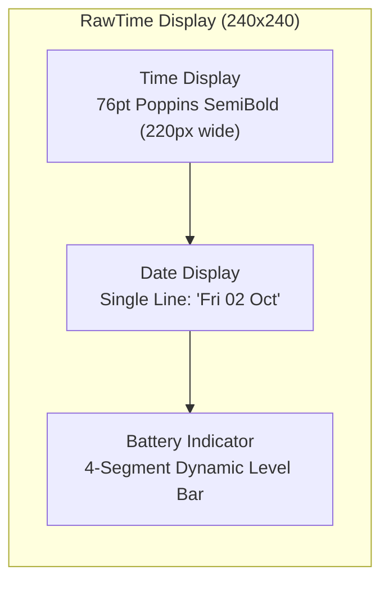
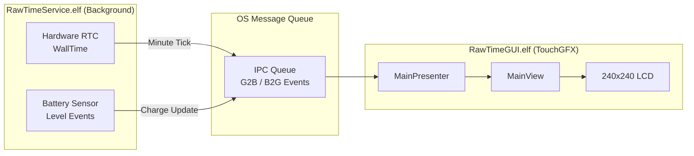

# RawTime

> Simple watch face for showing time, date, and battery — minimal, clean, and functional.

A clean, high-contrast digital watchface designed for the [UNA Watch](https://unawatch.com) (240×240 display).

```
+---------------------------------------+
|             240 x 240 px              |
|                                       |
|                                       |
|                10 : 42                |  <- 76pt Poppins SemiBold
|                                       |     (Edge-to-edge 220px width)
|                                       |
|              Fri 02 Oct               |  <- Single-Line Date (16pt)
|                                       |     (3-letter day & month)
|                [■■■■|]                |  <- 4-Segment Battery Bar
|                                       |     (Bottom-center)
+---------------------------------------+
```



## Features

- **Large Bold Digital Clock**: Giant, high-contrast time readout rendered in **76pt Poppins SemiBold** (`Poppins_SemiBold_76_2bpp`) spanning 220px horizontally for maximum legibility on the 240px screen with comfortable 10px margins. Supports 24-hour and 12-hour formats.
- **Single-Line Date**: Compact, clean date display underneath the clock in 16pt font (`Fri 02 Oct`), showing the 3-letter weekday, 2-digit day of the month, and 3-letter month name.
- **Battery Indicator**: Bottom-center vector battery gauge with 4 charge segments:
  - `75% - 100%`: 4 active segments
  - `50% - 74%`: 3 active segments
  - `25% - 49%`: 2 active segments
  - `1% - 24%`: 1 active segment
- **Power Efficient**: Adheres strictly to the UNA Watch power guidelines ("Do not subscribe to what you do not draw") — subscribes only to `BATTERY_LEVEL` sensor events and updates the display once per minute.

## Architecture

Built using the UNA Watch SDK two-process model:



1. **Service (`RawTimeService.elf`)**: Background daemon running on the RTOS kernel. Reads local time, monitors battery level, and posts IPC events.
2. **GUI (`RawTimeGUI.elf`)**: Foreground TouchGFX process that handles layout, typography rendering, and screen redraws.

## Building

### Prerequisites

- [UNA Watch SDK](https://github.com/UNAWatch/una-sdk)
- ST ARM GCC Toolchain (`arm-none-eabi-gcc` Cortex-M33, e.g. from STM32CubeCLT)
- CMake 3.21+ and GNU Make
- Python 3 with requirements from `$UNA_SDK/Utilities/Scripts/app_packer/requirements.txt`

### Build Instructions

```bash
# 1. Set UNA SDK path
export UNA_SDK="/path/to/una-sdk"

# 2. Configure build
cmake -B build Software/Apps/RawTime-CMake

# 3. Build and package .uapp
cmake --build build
```

The compiled package will be generated at:
```text
build/RawTime_0.0.2.uapp
```

## License

This project is licensed under the Apache 2.0 License - see the UNA Watch SDK documentation for details.
